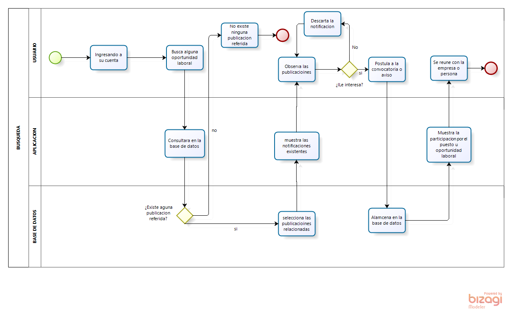

## PROCESOS DE EMPRESA

## 1. PROCESO DE VERIFICACION DE INDENTIDAD DEL PERFIL
> Este proceso empieza cuando un usuario quiere solicitar la verificacion de identidad de su perfil en la aplicacion.
> Comienza con solicitando la verificiacion el perfil
> Se comprueba si su perfil ya esta verificado.
> - Si esta verificado se le notifica que su perfil ya esta verificad - se finaliza el proceso.
> - No esta verificado el administrador autoriza la verificacion
> 
> La aplicacion notifica los documentos necesarios para la verificacion del perfil.
> El usuario carga los documentos necesarios y se revisa si los documentos estan completos.
> - No estan completos se procede a notificar que faltan documentos
> - Si estan completos se procede a revisar los documentos
> 
> Los documentos estan en orden y comprueban la identidad
> - Si comprueban se acepta la verificacion y se notifica que su perfil a sido verificado - se finaliza el proceso.
> - No se notifica que la verificacion a sido rechazada - se finaliza el proceso.

## 2. PROCESO DE INGRESO A LA APP
> proceso para el ingreso de la aplicacion, primero se le solicita al usuario que deba iniciar sesion, para ello se pregunta si tiene una cuenta.
> - Si tiene procede a introducir sus datos e inicia sesion
> ocurrio algun error cuando inicio sesion
> - No ingresa con exito a la app - fin del proceso.
> - Si ocurrio procede a recuperar contraseña
> 
> llamamos al procedo de recuperar contraseña e inici asesion correctamente - fin del proceso
> - No tiene procede a registrarse y envia los datos, ocurrio algun error durante el registro
> - No la cuenta fue creada con exito se inicia sesion automaticamento - fin del proceso
> - Si se notifica que hubo un error se procede a pedir los datos de nuevo

## 3. PROCESO DE BUSQUEDA DE EMPLEO

> El proceso empieza al iniciar con la búsqueda de un empleo u oportunidad laboral. El cual se consultara con la base de datos si existe algún anuncio o aviso existente.
> - De NO existir el proceso terminaría de manera inmediata.
> - De SI existir algún anuncio se mostrara en pantalla.
> 
> Posterior mente el usuario verificara que anuncio o aviso seria de su interés.
> - De No sea de su interés lo descartara y seguirá revisando las notificaciones existentes.
> - De Si ser de su interés postulara en la dicha convocatoria.
Se le mostrara al usuario su participación de en dicho oportunidad laboral, y concluirá con una reunión para la entrevista de trabajo.

## 4. PROCESO DE CONTRATACION DE PERSONAL

> Para la contratación de un nuevo personal para el proyecto, se empezara con la publicación de una nueva convocatoria, a la cual se espera la presentación de postulantes por el puesto laboral.
> - De No existir postulantes se volverá lanzar una nueva convocatoria.
> - De Si existir postulantes se procederá a la evaluación de su(s) currículos.
> 
> Posteriormente RRHH publicara una relación de postulantes aptos. 
> - De No estar apto o no estar en la relación terminaría con el proceso
> - De Si estar apto para el puesto, pasa a una segunda etapa de la entrevista personal.
> - Pero de No haber postulantes aptos se volverán a publicar la convocatoria de trabajo para la contratación de nuevo personal.
> - De Si haber postulantes aptos, pasaran a la entrevista personal.
> - Si después de la entrevista NO está apto para el puesto terminara el proceso de dicho postulante.
> 
> Si después de la entrevista Si está apto, se pasa a la selección.
Por último se tiene al o los postulantes seleccionados, y termina con la contratación y la firma de contratos.

## 5. PROCESO DE USO DE LA APP

> Entrar a página web de InfoWork donde nos saldrá dos opciones, de iniciar sesión o crear una cuenta.
> Si no tienes cuenta, puedes crearte una cuenta. Este paso será por medio Gmail, Facebook o correo, la creación de cuenta será completamente gratis. Al crear una cuenta nos ayuda a poder publicar, tener un perfil y acceder a otras funcionalidades
> -	Ingresar datos
> -	Verificar si la cuenta existe
> -	Crea cuenta si el usuario existe notificar registrar nuevo usuario
> -	Completar perfil o ir sesión de búsqueda de empleo o/yo publicar empleo
> 
> Si el usuario ya se registró anterior mente entonces, solamente se le pedirá su nombre de usuario y contraseña
> -	Pedir usuario y contraseña
> -	Iniciar sesión tan bien se podrá iniciar por Gmail, Facebook.
> Anteriormente registrado
> Verificar los datos si son válidos si datos no coinciden, se notificará al usuario, para posteriormente la recuperación de cuenta los datos son correctos se iniciará exitosamente.

